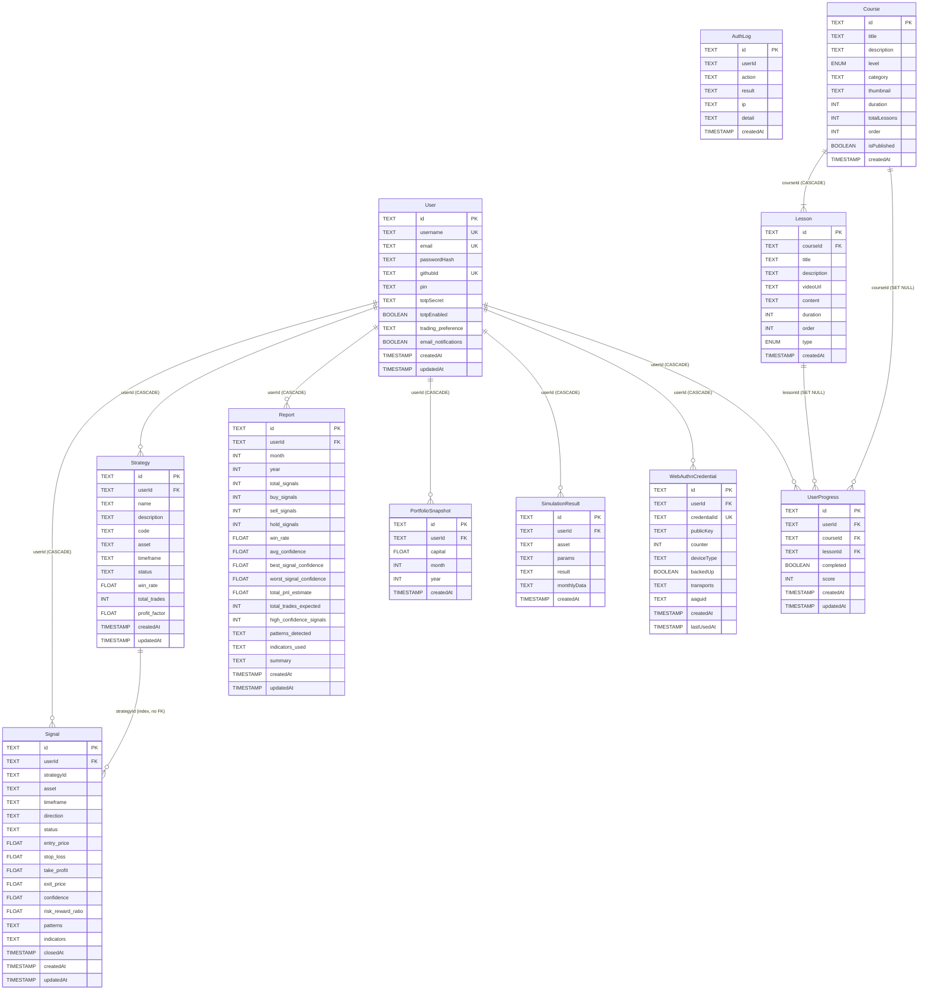

# Modèle Logique de Données (MLD) — Alvio

**Date :** 2026-06-23  
**Source :** `backend-code/prisma/schema.prisma` (lu et vérifié fichier par fichier)  
**ORM :** Prisma Client JS  
**Base cible :** PostgreSQL (provider déclaré dans schema.prisma)  
**Total tables SQL :** 11  
**Enums PostgreSQL :** 2 (`CourseLevel`, `LessonType`)

> **Convention de types** : Prisma map `String` → `TEXT`, `Int` → `INTEGER`,
> `Float` → `DOUBLE PRECISION`, `Boolean` → `BOOLEAN`, `DateTime` → `TIMESTAMP(3)`.
> Les cuids font 25 caractères max. `@updatedAt` est géré applicativement par Prisma.

---

## Enums PostgreSQL

```sql
CREATE TYPE "CourseLevel" AS ENUM ('DEBUTANT', 'INTERMEDIAIRE', 'AVANCE', 'EXPERT');
CREATE TYPE "LessonType"  AS ENUM ('VIDEO', 'ARTICLE', 'QUIZ');
```

---

## Table : `User`

| Colonne | Type SQL | Contrainte | Nullable | Défaut | Clé |
|---------|----------|-----------|----------|--------|-----|
| id | TEXT | NOT NULL | Non | cuid() (app) | PK |
| username | TEXT | UNIQUE NOT NULL | Non | — | UK |
| email | TEXT | UNIQUE NOT NULL | Non | — | UK |
| passwordHash | TEXT | — | Oui | NULL | |
| githubId | TEXT | UNIQUE | Oui | NULL | UK |
| pin | TEXT | — | Oui | NULL | |
| totpSecret | TEXT | — | Oui | NULL | |
| totpEnabled | BOOLEAN | NOT NULL | Non | false | |
| trading_preference | TEXT | — | Non | 'moderate' | |
| email_notifications | BOOLEAN | NOT NULL | Non | true | |
| createdAt | TIMESTAMP(3) | NOT NULL | Non | CURRENT_TIMESTAMP | |
| updatedAt | TIMESTAMP(3) | NOT NULL | Non | (géré par Prisma) | |

**Clés étrangères :** Aucune  
**Index :**
- `User_username_key` UNIQUE sur `(username)`
- `User_email_key` UNIQUE sur `(email)`
- `User_githubId_key` UNIQUE sur `(githubId)`

---

## Table : `Signal`

| Colonne | Type SQL | Contrainte | Nullable | Défaut | Clé |
|---------|----------|-----------|----------|--------|-----|
| id | TEXT | NOT NULL | Non | cuid() (app) | PK |
| userId | TEXT | NOT NULL | Non | — | FK → User(id) |
| strategyId | TEXT | — | Oui | NULL | (index, pas de FK SQL) |
| asset | TEXT | NOT NULL | Non | — | |
| timeframe | TEXT | — | Oui | NULL | |
| direction | TEXT | NOT NULL | Non | — | |
| status | TEXT | NOT NULL | Non | 'OPEN' | |
| entry_price | DOUBLE PRECISION | NOT NULL | Non | — | |
| stop_loss | DOUBLE PRECISION | NOT NULL | Non | — | |
| take_profit | DOUBLE PRECISION | NOT NULL | Non | — | |
| exit_price | DOUBLE PRECISION | — | Oui | NULL | |
| confidence | DOUBLE PRECISION | NOT NULL | Non | — | |
| risk_reward_ratio | DOUBLE PRECISION | — | Oui | NULL | |
| patterns | TEXT | — | Oui | NULL | (JSON sérialisé) |
| indicators | TEXT | — | Oui | NULL | (JSON sérialisé) |
| closedAt | TIMESTAMP(3) | — | Oui | NULL | |
| createdAt | TIMESTAMP(3) | NOT NULL | Non | CURRENT_TIMESTAMP | |
| updatedAt | TIMESTAMP(3) | NOT NULL | Non | (géré par Prisma) | |

**Clés étrangères :**
- `FOREIGN KEY (userId) REFERENCES "User"(id) ON DELETE CASCADE`

> `strategyId` : champ indexé mais **sans contrainte FK SQL** (intentionnel dans le schéma Prisma — compatibilité ascendante).

**Index :**
- `Signal_userId_idx` sur `(userId)`
- `Signal_asset_idx` sur `(asset)`
- `Signal_strategyId_idx` sur `(strategyId)`
- `Signal_strategyId_asset_direction_status_idx` sur `(strategyId, asset, direction, status)` — déduplication O(1)

---

## Table : `Strategy`

| Colonne | Type SQL | Contrainte | Nullable | Défaut | Clé |
|---------|----------|-----------|----------|--------|-----|
| id | TEXT | NOT NULL | Non | cuid() (app) | PK |
| userId | TEXT | NOT NULL | Non | — | FK → User(id) |
| name | TEXT | NOT NULL | Non | — | |
| description | TEXT | — | Oui | NULL | |
| code | TEXT | NOT NULL | Non | — | (JSON rules post-analyse IA) |
| asset | TEXT | NOT NULL | Non | — | |
| timeframe | TEXT | NOT NULL | Non | — | (15m\|1h\|4h\|1d) |
| status | TEXT | NOT NULL | Non | 'inactive' | |
| win_rate | DOUBLE PRECISION | — | Oui | NULL | |
| total_trades | INTEGER | — | Oui | NULL | |
| profit_factor | DOUBLE PRECISION | — | Oui | NULL | |
| createdAt | TIMESTAMP(3) | NOT NULL | Non | CURRENT_TIMESTAMP | |
| updatedAt | TIMESTAMP(3) | NOT NULL | Non | (géré par Prisma) | |

**Clés étrangères :**
- `FOREIGN KEY (userId) REFERENCES "User"(id) ON DELETE CASCADE`

**Index :**
- `Strategy_userId_idx` sur `(userId)`

---

## Table : `Report`

| Colonne | Type SQL | Contrainte | Nullable | Défaut | Clé |
|---------|----------|-----------|----------|--------|-----|
| id | TEXT | NOT NULL | Non | cuid() (app) | PK |
| userId | TEXT | NOT NULL | Non | — | FK → User(id) |
| month | INTEGER | NOT NULL | Non | — | (1–12) |
| year | INTEGER | NOT NULL | Non | — | |
| total_signals | INTEGER | NOT NULL | Non | — | |
| buy_signals | INTEGER | NOT NULL | Non | — | |
| sell_signals | INTEGER | NOT NULL | Non | — | |
| hold_signals | INTEGER | NOT NULL | Non | — | |
| win_rate | DOUBLE PRECISION | NOT NULL | Non | — | |
| avg_confidence | DOUBLE PRECISION | NOT NULL | Non | — | |
| best_signal_confidence | DOUBLE PRECISION | NOT NULL | Non | — | |
| worst_signal_confidence | DOUBLE PRECISION | NOT NULL | Non | — | |
| total_pnl_estimate | DOUBLE PRECISION | NOT NULL | Non | — | |
| total_trades_expected | INTEGER | NOT NULL | Non | — | |
| high_confidence_signals | INTEGER | NOT NULL | Non | — | |
| patterns_detected | TEXT | — | Oui | NULL | (JSON sérialisé) |
| indicators_used | TEXT | — | Oui | NULL | (JSON sérialisé) |
| summary | TEXT | — | Oui | NULL | |
| createdAt | TIMESTAMP(3) | NOT NULL | Non | CURRENT_TIMESTAMP | |
| updatedAt | TIMESTAMP(3) | NOT NULL | Non | (géré par Prisma) | |

**Clés étrangères :**
- `FOREIGN KEY (userId) REFERENCES "User"(id) ON DELETE CASCADE`

**Contraintes :**
- `Report_userId_month_year_key` UNIQUE sur `(userId, month, year)` — un seul rapport par mois/user

**Index :**
- `Report_userId_idx` sur `(userId)`

---

## Table : `PortfolioSnapshot`

| Colonne | Type SQL | Contrainte | Nullable | Défaut | Clé |
|---------|----------|-----------|----------|--------|-----|
| id | TEXT | NOT NULL | Non | cuid() (app) | PK |
| userId | TEXT | NOT NULL | Non | — | FK → User(id) |
| capital | DOUBLE PRECISION | NOT NULL | Non | — | |
| month | INTEGER | NOT NULL | Non | — | (1–12) |
| year | INTEGER | NOT NULL | Non | — | |
| createdAt | TIMESTAMP(3) | NOT NULL | Non | CURRENT_TIMESTAMP | |

**Clés étrangères :**
- `FOREIGN KEY (userId) REFERENCES "User"(id) ON DELETE CASCADE`

**Contraintes :**
- `PortfolioSnapshot_userId_month_year_key` UNIQUE sur `(userId, month, year)`

**Index :**
- `PortfolioSnapshot_userId_idx` sur `(userId)`

---

## Table : `SimulationResult`

| Colonne | Type SQL | Contrainte | Nullable | Défaut | Clé |
|---------|----------|-----------|----------|--------|-----|
| id | TEXT | NOT NULL | Non | cuid() (app) | PK |
| userId | TEXT | NOT NULL | Non | — | FK → User(id) |
| asset | TEXT | NOT NULL | Non | — | |
| params | TEXT | NOT NULL | Non | — | JSON: {initialAmount, monthlyInvestment, months, annualReturn, volatility, mode} |
| result | TEXT | NOT NULL | Non | — | JSON: {totalInvested, finalBalance, totalGains, roi} |
| monthlyData | TEXT | — | Oui | NULL | JSON array: [{month, balance, invested, monthlyContribution, gainLoss}] |
| createdAt | TIMESTAMP(3) | NOT NULL | Non | CURRENT_TIMESTAMP | |

**Clés étrangères :**
- `FOREIGN KEY (userId) REFERENCES "User"(id) ON DELETE CASCADE`

**Index :**
- `SimulationResult_userId_idx` sur `(userId)`

---

## Table : `WebAuthnCredential`

| Colonne | Type SQL | Contrainte | Nullable | Défaut | Clé |
|---------|----------|-----------|----------|--------|-----|
| id | TEXT | NOT NULL | Non | cuid() (app) | PK |
| userId | TEXT | NOT NULL | Non | — | FK → User(id) |
| credentialId | TEXT | UNIQUE NOT NULL | Non | — | UK (base64url FIDO2) |
| publicKey | TEXT | NOT NULL | Non | — | (base64url COSE key) |
| counter | INTEGER | NOT NULL | Non | 0 | |
| deviceType | TEXT | — | Oui | NULL | 'singleDevice'\|'multiDevice' |
| backedUp | BOOLEAN | NOT NULL | Non | false | |
| transports | TEXT | — | Oui | NULL | (JSON array of transports) |
| aaguid | TEXT | — | Oui | NULL | |
| createdAt | TIMESTAMP(3) | NOT NULL | Non | CURRENT_TIMESTAMP | |
| lastUsedAt | TIMESTAMP(3) | — | Oui | NULL | |

**Clés étrangères :**
- `FOREIGN KEY (userId) REFERENCES "User"(id) ON DELETE CASCADE`

**Contraintes :**
- `WebAuthnCredential_credentialId_key` UNIQUE sur `(credentialId)`

**Index :**
- `WebAuthnCredential_userId_idx` sur `(userId)`

---

## Table : `AuthLog`

| Colonne | Type SQL | Contrainte | Nullable | Défaut | Clé |
|---------|----------|-----------|----------|--------|-----|
| id | TEXT | NOT NULL | Non | cuid() (app) | PK |
| userId | TEXT | — | Oui | NULL | (pas de FK — intentionnel pour les tentatives anonymes) |
| action | TEXT | NOT NULL | Non | — | AUTH_SUCCESS\|AUTH_FAILURE\|MFA_ENROLLED\|MFA_REVOKED\|ACCOUNT_LOCKED\|SESSION_CREATED\|SESSION_EXPIRED\|SUSPICIOUS_IP |
| result | TEXT | NOT NULL | Non | — | 'SUCCESS'\|'FAILURE' |
| ip | TEXT | — | Oui | NULL | |
| detail | TEXT | — | Oui | NULL | |
| createdAt | TIMESTAMP(3) | NOT NULL | Non | CURRENT_TIMESTAMP | |

**Clés étrangères :** Aucune (userId est un champ libre, pas une FK SQL)  
**Index :** Aucun déclaré dans le schéma

---

## Table : `Course`

| Colonne | Type SQL | Contrainte | Nullable | Défaut | Clé |
|---------|----------|-----------|----------|--------|-----|
| id | TEXT | NOT NULL | Non | cuid() (app) | PK |
| title | TEXT | NOT NULL | Non | — | |
| description | TEXT | NOT NULL | Non | — | |
| level | "CourseLevel" | NOT NULL | Non | — | ENUM |
| category | TEXT | NOT NULL | Non | — | |
| thumbnail | TEXT | — | Oui | NULL | |
| duration | INTEGER | NOT NULL | Non | — | (minutes) |
| totalLessons | INTEGER | NOT NULL | Non | — | |
| order | INTEGER | NOT NULL | Non | — | |
| isPublished | BOOLEAN | NOT NULL | Non | false | |
| createdAt | TIMESTAMP(3) | NOT NULL | Non | CURRENT_TIMESTAMP | |

**Clés étrangères :** Aucune  
**Index :**
- `Course_level_idx` sur `(level)`
- `Course_isPublished_idx` sur `(isPublished)`

---

## Table : `Lesson`

| Colonne | Type SQL | Contrainte | Nullable | Défaut | Clé |
|---------|----------|-----------|----------|--------|-----|
| id | TEXT | NOT NULL | Non | cuid() (app) | PK |
| courseId | TEXT | NOT NULL | Non | — | FK → Course(id) |
| title | TEXT | NOT NULL | Non | — | |
| description | TEXT | NOT NULL | Non | — | |
| videoUrl | TEXT | — | Oui | NULL | |
| content | TEXT | NOT NULL | Non | — | |
| duration | INTEGER | NOT NULL | Non | — | (minutes) |
| order | INTEGER | NOT NULL | Non | — | |
| type | "LessonType" | NOT NULL | Non | — | ENUM |
| createdAt | TIMESTAMP(3) | NOT NULL | Non | CURRENT_TIMESTAMP | |

**Clés étrangères :**
- `FOREIGN KEY (courseId) REFERENCES "Course"(id) ON DELETE CASCADE`

**Index :**
- `Lesson_courseId_idx` sur `(courseId)`

---

## Table : `UserProgress`

| Colonne | Type SQL | Contrainte | Nullable | Défaut | Clé |
|---------|----------|-----------|----------|--------|-----|
| id | TEXT | NOT NULL | Non | cuid() (app) | PK |
| userId | TEXT | NOT NULL | Non | — | FK → User(id) |
| courseId | TEXT | — | Oui | NULL | FK → Course(id) |
| lessonId | TEXT | — | Oui | NULL | FK → Lesson(id) |
| completed | BOOLEAN | NOT NULL | Non | false | |
| score | INTEGER | — | Oui | NULL | (score quiz) |
| createdAt | TIMESTAMP(3) | NOT NULL | Non | CURRENT_TIMESTAMP | |
| updatedAt | TIMESTAMP(3) | NOT NULL | Non | (géré par Prisma) | |

**Clés étrangères :**
- `FOREIGN KEY (userId) REFERENCES "User"(id) ON DELETE CASCADE`
- `FOREIGN KEY (courseId) REFERENCES "Course"(id) ON DELETE SET NULL`
- `FOREIGN KEY (lessonId) REFERENCES "Lesson"(id) ON DELETE SET NULL`

**Contraintes :**
- `UserProgress_userId_lessonId_key` UNIQUE sur `(userId, lessonId)`

**Index :**
- `UserProgress_userId_idx` sur `(userId)`
- `UserProgress_courseId_idx` sur `(courseId)`

---

## Récapitulatif des relations

| Table source | Colonne | Référence | ON DELETE |
|-------------|---------|-----------|-----------|
| Signal | userId | User(id) | CASCADE |
| Strategy | userId | User(id) | CASCADE |
| Report | userId | User(id) | CASCADE |
| PortfolioSnapshot | userId | User(id) | CASCADE |
| SimulationResult | userId | User(id) | CASCADE |
| WebAuthnCredential | userId | User(id) | CASCADE |
| UserProgress | userId | User(id) | CASCADE |
| UserProgress | courseId | Course(id) | SET NULL |
| UserProgress | lessonId | Lesson(id) | SET NULL |
| Lesson | courseId | Course(id) | CASCADE |

> **Note :** `Signal.strategyId` → pas de FK SQL déclarée (champ String? indexé uniquement).  
> **Note :** `AuthLog.userId` → pas de FK SQL (intentionnel : log les tentatives anonymes).

---

## DDL SQL complet — CREATE TABLE

```sql
-- ─────────────────────────────────────────────────────────────────────────────
-- ENUMS
-- ─────────────────────────────────────────────────────────────────────────────

CREATE TYPE "CourseLevel" AS ENUM (
  'DEBUTANT',
  'INTERMEDIAIRE',
  'AVANCE',
  'EXPERT'
);

CREATE TYPE "LessonType" AS ENUM (
  'VIDEO',
  'ARTICLE',
  'QUIZ'
);

-- ─────────────────────────────────────────────────────────────────────────────
-- TABLE : User
-- ─────────────────────────────────────────────────────────────────────────────

CREATE TABLE "User" (
  id                  TEXT          NOT NULL,
  username            TEXT          NOT NULL,
  email               TEXT          NOT NULL,
  "passwordHash"      TEXT,
  "githubId"          TEXT,
  pin                 TEXT,
  "totpSecret"        TEXT,
  "totpEnabled"       BOOLEAN       NOT NULL DEFAULT false,
  trading_preference  TEXT          NOT NULL DEFAULT 'moderate',
  email_notifications BOOLEAN       NOT NULL DEFAULT true,
  "createdAt"         TIMESTAMP(3)  NOT NULL DEFAULT CURRENT_TIMESTAMP,
  "updatedAt"         TIMESTAMP(3)  NOT NULL,

  CONSTRAINT "User_pkey"       PRIMARY KEY (id),
  CONSTRAINT "User_username_key" UNIQUE (username),
  CONSTRAINT "User_email_key"    UNIQUE (email),
  CONSTRAINT "User_githubId_key" UNIQUE ("githubId")
);

-- ─────────────────────────────────────────────────────────────────────────────
-- TABLE : Strategy  (avant Signal car Signal y fait référence en index)
-- ─────────────────────────────────────────────────────────────────────────────

CREATE TABLE "Strategy" (
  id            TEXT            NOT NULL,
  "userId"      TEXT            NOT NULL,
  name          TEXT            NOT NULL,
  description   TEXT,
  code          TEXT            NOT NULL,
  asset         TEXT            NOT NULL,
  timeframe     TEXT            NOT NULL,
  status        TEXT            NOT NULL DEFAULT 'inactive',
  win_rate      DOUBLE PRECISION,
  total_trades  INTEGER,
  profit_factor DOUBLE PRECISION,
  "createdAt"   TIMESTAMP(3)    NOT NULL DEFAULT CURRENT_TIMESTAMP,
  "updatedAt"   TIMESTAMP(3)    NOT NULL,

  CONSTRAINT "Strategy_pkey" PRIMARY KEY (id),
  CONSTRAINT "Strategy_userId_fkey"
    FOREIGN KEY ("userId") REFERENCES "User"(id) ON DELETE CASCADE
);

CREATE INDEX "Strategy_userId_idx" ON "Strategy"("userId");

-- ─────────────────────────────────────────────────────────────────────────────
-- TABLE : Signal
-- ─────────────────────────────────────────────────────────────────────────────

CREATE TABLE "Signal" (
  id                TEXT            NOT NULL,
  "userId"          TEXT            NOT NULL,
  "strategyId"      TEXT,
  asset             TEXT            NOT NULL,
  timeframe         TEXT,
  direction         TEXT            NOT NULL,
  status            TEXT            NOT NULL DEFAULT 'OPEN',
  entry_price       DOUBLE PRECISION NOT NULL,
  stop_loss         DOUBLE PRECISION NOT NULL,
  take_profit       DOUBLE PRECISION NOT NULL,
  exit_price        DOUBLE PRECISION,
  confidence        DOUBLE PRECISION NOT NULL,
  risk_reward_ratio DOUBLE PRECISION,
  patterns          TEXT,
  indicators        TEXT,
  "closedAt"        TIMESTAMP(3),
  "createdAt"       TIMESTAMP(3)    NOT NULL DEFAULT CURRENT_TIMESTAMP,
  "updatedAt"       TIMESTAMP(3)    NOT NULL,

  CONSTRAINT "Signal_pkey" PRIMARY KEY (id),
  CONSTRAINT "Signal_userId_fkey"
    FOREIGN KEY ("userId") REFERENCES "User"(id) ON DELETE CASCADE
  -- strategyId : pas de FK SQL (intentionnel)
);

CREATE INDEX "Signal_userId_idx"   ON "Signal"("userId");
CREATE INDEX "Signal_asset_idx"    ON "Signal"(asset);
CREATE INDEX "Signal_strategyId_idx" ON "Signal"("strategyId");
CREATE INDEX "Signal_strategyId_asset_direction_status_idx"
  ON "Signal"("strategyId", asset, direction, status);

-- ─────────────────────────────────────────────────────────────────────────────
-- TABLE : Report
-- ─────────────────────────────────────────────────────────────────────────────

CREATE TABLE "Report" (
  id                       TEXT            NOT NULL,
  "userId"                 TEXT            NOT NULL,
  month                    INTEGER         NOT NULL,
  year                     INTEGER         NOT NULL,
  total_signals            INTEGER         NOT NULL,
  buy_signals              INTEGER         NOT NULL,
  sell_signals             INTEGER         NOT NULL,
  hold_signals             INTEGER         NOT NULL,
  win_rate                 DOUBLE PRECISION NOT NULL,
  avg_confidence           DOUBLE PRECISION NOT NULL,
  best_signal_confidence   DOUBLE PRECISION NOT NULL,
  worst_signal_confidence  DOUBLE PRECISION NOT NULL,
  total_pnl_estimate       DOUBLE PRECISION NOT NULL,
  total_trades_expected    INTEGER         NOT NULL,
  high_confidence_signals  INTEGER         NOT NULL,
  patterns_detected        TEXT,
  indicators_used          TEXT,
  summary                  TEXT,
  "createdAt"              TIMESTAMP(3)    NOT NULL DEFAULT CURRENT_TIMESTAMP,
  "updatedAt"              TIMESTAMP(3)    NOT NULL,

  CONSTRAINT "Report_pkey" PRIMARY KEY (id),
  CONSTRAINT "Report_userId_month_year_key" UNIQUE ("userId", month, year),
  CONSTRAINT "Report_userId_fkey"
    FOREIGN KEY ("userId") REFERENCES "User"(id) ON DELETE CASCADE
);

CREATE INDEX "Report_userId_idx" ON "Report"("userId");

-- ─────────────────────────────────────────────────────────────────────────────
-- TABLE : PortfolioSnapshot
-- ─────────────────────────────────────────────────────────────────────────────

CREATE TABLE "PortfolioSnapshot" (
  id        TEXT            NOT NULL,
  "userId"  TEXT            NOT NULL,
  capital   DOUBLE PRECISION NOT NULL,
  month     INTEGER         NOT NULL,
  year      INTEGER         NOT NULL,
  "createdAt" TIMESTAMP(3)  NOT NULL DEFAULT CURRENT_TIMESTAMP,

  CONSTRAINT "PortfolioSnapshot_pkey" PRIMARY KEY (id),
  CONSTRAINT "PortfolioSnapshot_userId_month_year_key"
    UNIQUE ("userId", month, year),
  CONSTRAINT "PortfolioSnapshot_userId_fkey"
    FOREIGN KEY ("userId") REFERENCES "User"(id) ON DELETE CASCADE
);

CREATE INDEX "PortfolioSnapshot_userId_idx" ON "PortfolioSnapshot"("userId");

-- ─────────────────────────────────────────────────────────────────────────────
-- TABLE : SimulationResult
-- ─────────────────────────────────────────────────────────────────────────────

CREATE TABLE "SimulationResult" (
  id           TEXT         NOT NULL,
  "userId"     TEXT         NOT NULL,
  asset        TEXT         NOT NULL,
  params       TEXT         NOT NULL,
  result       TEXT         NOT NULL,
  "monthlyData" TEXT,
  "createdAt"  TIMESTAMP(3) NOT NULL DEFAULT CURRENT_TIMESTAMP,

  CONSTRAINT "SimulationResult_pkey" PRIMARY KEY (id),
  CONSTRAINT "SimulationResult_userId_fkey"
    FOREIGN KEY ("userId") REFERENCES "User"(id) ON DELETE CASCADE
);

CREATE INDEX "SimulationResult_userId_idx" ON "SimulationResult"("userId");

-- ─────────────────────────────────────────────────────────────────────────────
-- TABLE : WebAuthnCredential
-- ─────────────────────────────────────────────────────────────────────────────

CREATE TABLE "WebAuthnCredential" (
  id             TEXT         NOT NULL,
  "userId"       TEXT         NOT NULL,
  "credentialId" TEXT         NOT NULL,
  "publicKey"    TEXT         NOT NULL,
  counter        INTEGER      NOT NULL DEFAULT 0,
  "deviceType"   TEXT,
  "backedUp"     BOOLEAN      NOT NULL DEFAULT false,
  transports     TEXT,
  aaguid         TEXT,
  "createdAt"    TIMESTAMP(3) NOT NULL DEFAULT CURRENT_TIMESTAMP,
  "lastUsedAt"   TIMESTAMP(3),

  CONSTRAINT "WebAuthnCredential_pkey" PRIMARY KEY (id),
  CONSTRAINT "WebAuthnCredential_credentialId_key" UNIQUE ("credentialId"),
  CONSTRAINT "WebAuthnCredential_userId_fkey"
    FOREIGN KEY ("userId") REFERENCES "User"(id) ON DELETE CASCADE
);

CREATE INDEX "WebAuthnCredential_userId_idx" ON "WebAuthnCredential"("userId");

-- ─────────────────────────────────────────────────────────────────────────────
-- TABLE : AuthLog
-- ─────────────────────────────────────────────────────────────────────────────

CREATE TABLE "AuthLog" (
  id         TEXT         NOT NULL,
  "userId"   TEXT,
  action     TEXT         NOT NULL,
  result     TEXT         NOT NULL,
  ip         TEXT,
  detail     TEXT,
  "createdAt" TIMESTAMP(3) NOT NULL DEFAULT CURRENT_TIMESTAMP,

  CONSTRAINT "AuthLog_pkey" PRIMARY KEY (id)
  -- userId intentionnellement sans FK pour capturer les tentatives anonymes
);

-- ─────────────────────────────────────────────────────────────────────────────
-- TABLE : Course
-- ─────────────────────────────────────────────────────────────────────────────

CREATE TABLE "Course" (
  id           TEXT           NOT NULL,
  title        TEXT           NOT NULL,
  description  TEXT           NOT NULL,
  level        "CourseLevel"  NOT NULL,
  category     TEXT           NOT NULL,
  thumbnail    TEXT,
  duration     INTEGER        NOT NULL,
  "totalLessons" INTEGER      NOT NULL,
  "order"      INTEGER        NOT NULL,
  "isPublished" BOOLEAN       NOT NULL DEFAULT false,
  "createdAt"  TIMESTAMP(3)   NOT NULL DEFAULT CURRENT_TIMESTAMP,

  CONSTRAINT "Course_pkey" PRIMARY KEY (id)
);

CREATE INDEX "Course_level_idx"       ON "Course"(level);
CREATE INDEX "Course_isPublished_idx" ON "Course"("isPublished");

-- ─────────────────────────────────────────────────────────────────────────────
-- TABLE : Lesson
-- ─────────────────────────────────────────────────────────────────────────────

CREATE TABLE "Lesson" (
  id          TEXT          NOT NULL,
  "courseId"  TEXT          NOT NULL,
  title       TEXT          NOT NULL,
  description TEXT          NOT NULL,
  "videoUrl"  TEXT,
  content     TEXT          NOT NULL,
  duration    INTEGER       NOT NULL,
  "order"     INTEGER       NOT NULL,
  type        "LessonType"  NOT NULL,
  "createdAt" TIMESTAMP(3)  NOT NULL DEFAULT CURRENT_TIMESTAMP,

  CONSTRAINT "Lesson_pkey" PRIMARY KEY (id),
  CONSTRAINT "Lesson_courseId_fkey"
    FOREIGN KEY ("courseId") REFERENCES "Course"(id) ON DELETE CASCADE
);

CREATE INDEX "Lesson_courseId_idx" ON "Lesson"("courseId");

-- ─────────────────────────────────────────────────────────────────────────────
-- TABLE : UserProgress
-- ─────────────────────────────────────────────────────────────────────────────

CREATE TABLE "UserProgress" (
  id         TEXT         NOT NULL,
  "userId"   TEXT         NOT NULL,
  "courseId" TEXT,
  "lessonId" TEXT,
  completed  BOOLEAN      NOT NULL DEFAULT false,
  score      INTEGER,
  "createdAt" TIMESTAMP(3) NOT NULL DEFAULT CURRENT_TIMESTAMP,
  "updatedAt" TIMESTAMP(3) NOT NULL,

  CONSTRAINT "UserProgress_pkey" PRIMARY KEY (id),
  CONSTRAINT "UserProgress_userId_lessonId_key"
    UNIQUE ("userId", "lessonId"),
  CONSTRAINT "UserProgress_userId_fkey"
    FOREIGN KEY ("userId") REFERENCES "User"(id) ON DELETE CASCADE,
  CONSTRAINT "UserProgress_courseId_fkey"
    FOREIGN KEY ("courseId") REFERENCES "Course"(id) ON DELETE SET NULL,
  CONSTRAINT "UserProgress_lessonId_fkey"
    FOREIGN KEY ("lessonId") REFERENCES "Lesson"(id) ON DELETE SET NULL
);

CREATE INDEX "UserProgress_userId_idx"   ON "UserProgress"("userId");
CREATE INDEX "UserProgress_courseId_idx" ON "UserProgress"("courseId");
```

---

## Diagramme MLD (Mermaid erDiagram)


