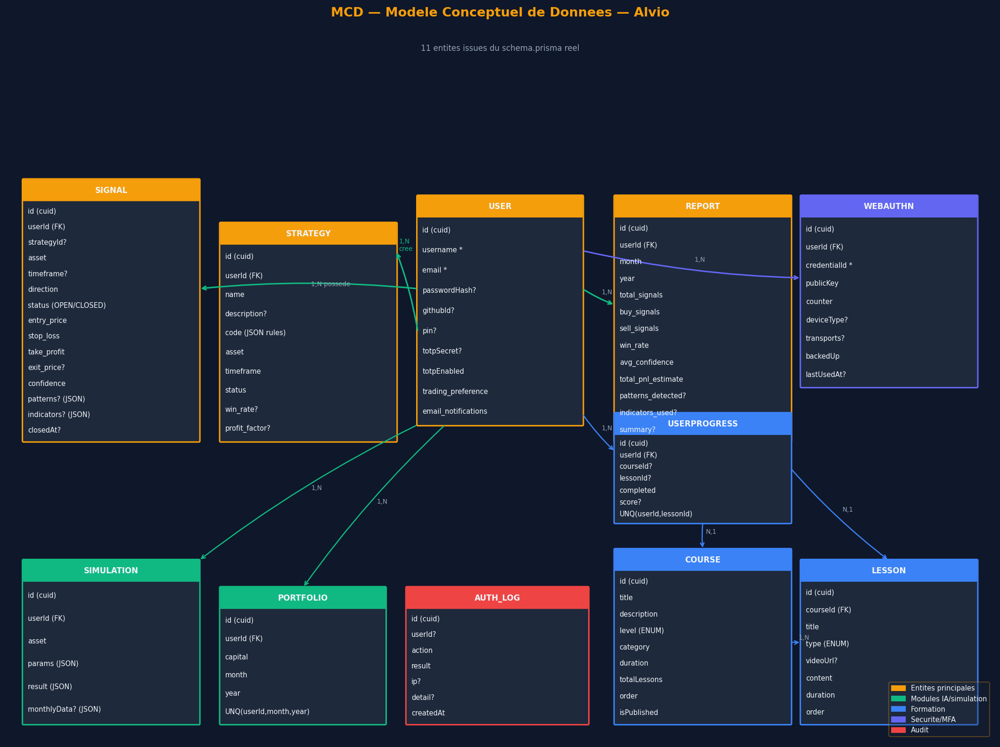
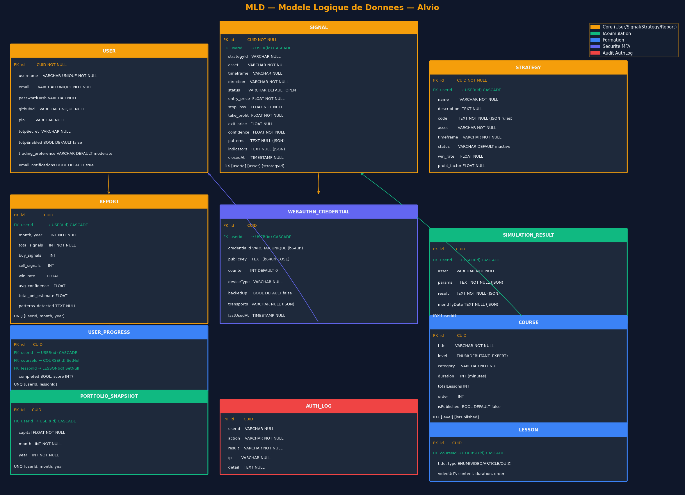
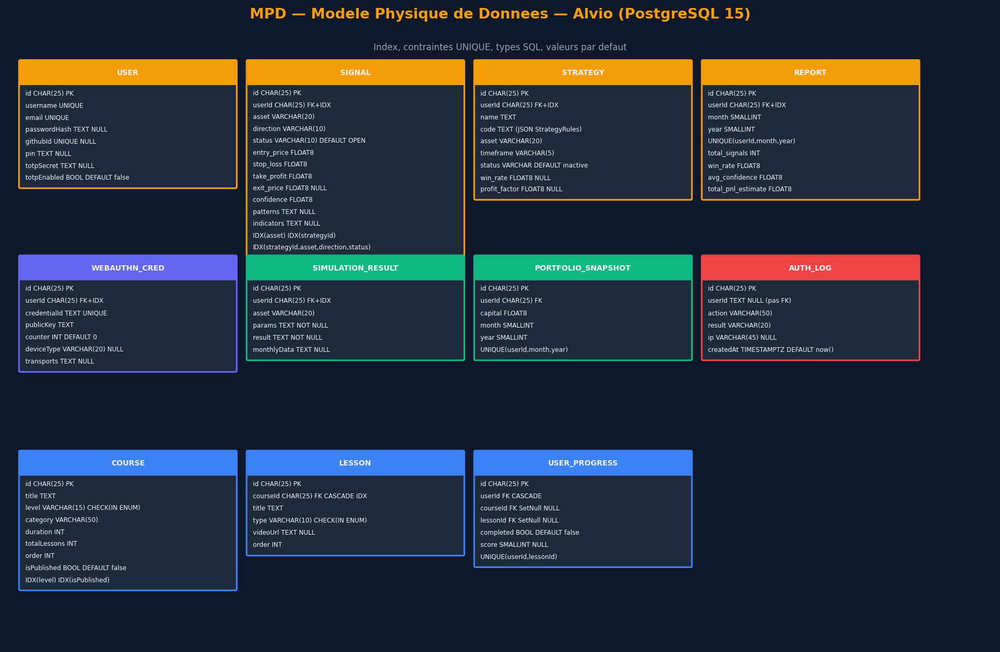

# Conception de la Base de Données

---

## Système de gestion de données

| Paramètre | Valeur |
|---|---|
| SGBD | PostgreSQL 15 |
| ORM | Prisma v5.22.0 |
| Nombre de modèles | 11 |
| Clés primaires | CUID (`@default(cuid())`) — identifiants courts et non-séquentiels |
| Environnement dev | SQLite possible (fichier `dev.db`) |
| Environnement prod | PostgreSQL 15 (Docker `postgres:15`) |

---

## Dictionnaire de données

### USER — Utilisateur

Entité centrale du système. Supporte plusieurs modes d'authentification
(email/password, GitHub OAuth, Magic Link) et plusieurs facteurs MFA (OTP,
TOTP, WebAuthn, PIN).

| Champ | Type SQL | Contraintes | Description |
|---|---|---|---|
| `id` | CHAR(25) | PK, NOT NULL | CUID généré automatiquement |
| `username` | VARCHAR | UNIQUE, NOT NULL | Identifiant affiché |
| `email` | VARCHAR | UNIQUE, NOT NULL | Adresse email principale |
| `passwordHash` | TEXT | NULL | Hash bcrypt 12 rounds ; NULL si auth GitHub/MagicLink |
| `githubId` | VARCHAR | UNIQUE, NULL | ID GitHub OAuth ; NULL si auth classique |
| `pin` | TEXT | NULL | 3ème facteur ; hashé bcrypt |
| `totpSecret` | TEXT | NULL | Secret TOTP chiffré AES-256-GCM |
| `totpEnabled` | BOOL | DEFAULT false | TOTP activé/désactivé |
| `trading_preference` | VARCHAR | DEFAULT 'moderate' | Profil de risque (`conservative` / `moderate` / `aggressive`) |
| `email_notifications` | BOOL | DEFAULT true | Notifications email signaux |
| `createdAt` | TIMESTAMPTZ | DEFAULT now() | Date de création |
| `updatedAt` | TIMESTAMPTZ | @updatedAt | Mise à jour automatique |

Relations : → `Signal[]`, `Strategy[]`, `Report[]`, `WebAuthnCredential[]`,
`UserProgress[]`, `PortfolioSnapshot[]`, `SimulationResult[]`

---

### SIGNAL — Signal de trading

Représente une opportunité d'entrée ou de sortie de marché détectée par le
moteur IA. Design **long-only** : `direction` vaut toujours `BUY` pour une
entrée ; la sortie est modélisée par `status='CLOSED'` + `exit_price` sur le
signal BUY existant (pas de signal SELL distinct).

| Champ | Type SQL | Contraintes | Description |
|---|---|---|---|
| `id` | CHAR(25) | PK | CUID |
| `userId` | CHAR(25) | FK → User, IDX | Propriétaire du signal |
| `strategyId` | VARCHAR | NULL, IDX | Stratégie source (optionnel) |
| `asset` | VARCHAR(20) | NOT NULL, IDX | Ex : `BTC`, `ETH`, `SOL` |
| `timeframe` | VARCHAR | NULL | Ex : `15m`, `1h`, `4h`, `1d` |
| `direction` | VARCHAR(10) | NOT NULL | `BUY` \| `SELL` \| `HOLD` |
| `status` | VARCHAR(10) | DEFAULT 'OPEN' | `OPEN` \| `CLOSED` |
| `entry_price` | FLOAT8 | NOT NULL | Prix d'entrée |
| `stop_loss` | FLOAT8 | NOT NULL | Niveau stop-loss |
| `take_profit` | FLOAT8 | NOT NULL | Objectif de profit |
| `exit_price` | FLOAT8 | NULL | Renseigné à la clôture (EXIT_SIGNAL) |
| `confidence` | FLOAT8 | NOT NULL | Score de confiance 0–100 (%) |
| `risk_reward_ratio` | FLOAT8 | NULL | Ratio risque/rendement |
| `patterns` | TEXT | NULL | JSON array — patterns détectés |
| `indicators` | TEXT | NULL | JSON object — valeurs indicateurs |
| `closedAt` | TIMESTAMPTZ | NULL | Date de clôture |
| `createdAt` | TIMESTAMPTZ | NOT NULL | Date de création |

Index composite : `[strategyId, asset, direction, status]` — utilisé par la
déduplication (`findFirst` pour éviter deux BUY OPEN sur le même asset/stratégie).

---

### STRATEGY — Stratégie de trading

Contient les règles JSON extraites par Claude à partir d'un document PDF.
Le champ `code` stocke un objet `StrategyRules` sérialisé.

| Champ | Type SQL | Contraintes | Description |
|---|---|---|---|
| `id` | CHAR(25) | PK | CUID |
| `userId` | CHAR(25) | FK → User, IDX | Propriétaire |
| `name` | TEXT | NOT NULL | Nom de la stratégie |
| `description` | TEXT | NULL | Description libre |
| `code` | TEXT | NOT NULL | JSON `StrategyRules` (entry/exit conditions, risk_management) |
| `asset` | VARCHAR(20) | NOT NULL | Actif ciblé |
| `timeframe` | VARCHAR(5) | NOT NULL | `15m` \| `1h` \| `4h` \| `1d` |
| `status` | VARCHAR | DEFAULT 'inactive' | `inactive` \| `active` |
| `win_rate` | FLOAT8 | NULL | Taux de réussite (calculé) |
| `total_trades` | INT | NULL | Nombre de trades |
| `profit_factor` | FLOAT8 | NULL | Facteur de profit |

---

### REPORT — Rapport mensuel

Agrégation des statistiques de trading par mois, calculée par `ReportsService`
à partir des signaux de l'utilisateur.

| Champ | Type SQL | Contraintes | Description |
|---|---|---|---|
| `id` | CHAR(25) | PK | CUID |
| `userId` | CHAR(25) | FK → User | Propriétaire |
| `month` | SMALLINT | NOT NULL | Mois (1–12) |
| `year` | SMALLINT | NOT NULL | Année |
| `total_signals` | INT | NOT NULL | Entrées + sorties du mois |
| `buy_signals` | INT | | Entrées (createdAt dans le mois) |
| `sell_signals` | INT | | Sorties (closedAt dans le mois) |
| `hold_signals` | INT | | Positions OPEN en fin de mois |
| `win_rate` | FLOAT8 | | % clôtures avec exit_price > entry_price |
| `avg_confidence` | FLOAT8 | | Confiance moyenne des entrées |
| `best_signal_confidence` | FLOAT8 | | Meilleure confiance du mois |
| `worst_signal_confidence` | FLOAT8 | | Pire confiance du mois |
| `total_pnl_estimate` | FLOAT8 | | Somme (exit_price − entry_price) |
| `total_trades_expected` | INT | | max(buy_signals, sell_signals) |
| `high_confidence_signals` | INT | | Signaux avec confidence > 80 % |
| `patterns_detected` | TEXT | NULL | JSON — comptage par pattern |
| `indicators_used` | TEXT | NULL | JSON — liste des indicateurs |
| `summary` | TEXT | NULL | Texte résumé auto-généré |

Contrainte unique : `[userId, month, year]`

---

### AUTH_LOG — Journal d'audit d'authentification

Trace chaque tentative d'authentification. `userId` est nullable pour
capturer les tentatives sur des emails inexistants.

| Champ | Type SQL | Contraintes | Description |
|---|---|---|---|
| `id` | CHAR(25) | PK | CUID |
| `userId` | TEXT | NULL | Utilisateur ciblé (si connu) |
| `action` | VARCHAR(50) | NOT NULL | `login`, `register`, `2fa_verify`, `pin_verify`… |
| `result` | VARCHAR(20) | NOT NULL | `success` \| `failure` \| `blocked` |
| `ip` | VARCHAR(45) | NULL | Adresse IP source (IPv4 ou IPv6) |
| `detail` | TEXT | NULL | Message d'erreur ou contexte |
| `createdAt` | TIMESTAMPTZ | DEFAULT now() | Timestamp |

---

### WEBAUTHN_CREDENTIAL — Clé WebAuthn FIDO2

Une clé par appareil enregistré. Le `counter` est vérifié à chaque
authentification pour prévenir les attaques par rejeu.

| Champ | Type SQL | Contraintes | Description |
|---|---|---|---|
| `id` | CHAR(25) | PK | CUID |
| `userId` | CHAR(25) | FK → User, IDX | Propriétaire |
| `credentialId` | TEXT | UNIQUE | Identifiant base64url de la clé |
| `publicKey` | TEXT | NOT NULL | Clé publique COSE base64url |
| `counter` | INT | DEFAULT 0 | Compteur anti-rejeu |
| `deviceType` | VARCHAR(20) | NULL | `singleDevice` \| `multiDevice` |
| `backedUp` | BOOL | DEFAULT false | Clé sauvegardée cloud |
| `transports` | TEXT | NULL | JSON array (`usb`, `nfc`, `internal`…) |
| `aaguid` | VARCHAR | NULL | Identifiant du modèle d'authenticateur |
| `lastUsedAt` | TIMESTAMPTZ | NULL | Dernière utilisation |

---

### SIMULATION_RESULT — Résultat de simulation DCA

Persistance des simulations d'intérêt composé. Les champs `params` et
`result` sont des JSON sérialisés.

| Champ | Type SQL | Description |
|---|---|---|
| `id` | CHAR(25) PK | CUID |
| `userId` | CHAR(25) FK | Propriétaire |
| `asset` | VARCHAR | Actif simulé |
| `params` | TEXT (JSON) | `{ initialAmount, monthlyInvestment, months, annualReturn, volatility, mode }` |
| `result` | TEXT (JSON) | `{ totalInvested, finalBalance, totalGains, roi }` |
| `monthlyData` | TEXT (JSON) | Array mensuel `[{ month, balance, invested, monthlyContribution, gainLoss }]` |

---

### PORTFOLIO_SNAPSHOT — Instantané de portefeuille

Snapshot mensuel du capital de l'utilisateur.

| Champ | Type SQL | Contraintes |
|---|---|---|
| `id` | CHAR(25) | PK |
| `userId` | CHAR(25) | FK → User |
| `capital` | FLOAT8 | NOT NULL |
| `month` | SMALLINT | NOT NULL (1–12) |
| `year` | SMALLINT | NOT NULL |

Contrainte unique : `[userId, month, year]`

---

### COURSE — Cours de formation

Module du LMS intégré à Alvio. Chaque cours contient plusieurs leçons.

| Champ | Type SQL | Description |
|---|---|---|
| `id` | CHAR(25) PK | CUID |
| `title` | TEXT | Titre du cours |
| `description` | TEXT | Description |
| `level` | ENUM | `DEBUTANT` \| `INTERMEDIAIRE` \| `AVANCE` \| `EXPERT` |
| `category` | VARCHAR | Ex : `analyse_technique`, `gestion_du_risque` |
| `thumbnail` | TEXT NULL | URL image de couverture |
| `duration` | INT | Durée totale en minutes |
| `totalLessons` | INT | Nombre de leçons |
| `order` | INT | Ordre d'affichage dans le catalogue |
| `isPublished` | BOOL DEFAULT false | Visibilité |

Index : `[level]`, `[isPublished]`

---

### LESSON — Leçon

Contenu unitaire d'un cours. Type `VIDEO` : lien YouTube ; `ARTICLE` : contenu
Markdown ; `QUIZ` : contenu JSON avec questions/réponses.

| Champ | Type SQL | Description |
|---|---|---|
| `id` | CHAR(25) PK | CUID |
| `courseId` | CHAR(25) FK → Course | Cours parent (CASCADE DELETE) |
| `title` | TEXT | Titre de la leçon |
| `description` | TEXT | Résumé |
| `videoUrl` | TEXT NULL | URL vidéo (YouTube embed) |
| `content` | TEXT | Corps de la leçon |
| `duration` | INT | Durée estimée en minutes |
| `order` | INT | Ordre dans le cours |
| `type` | ENUM | `VIDEO` \| `ARTICLE` \| `QUIZ` |

---

### USER_PROGRESS — Progression utilisateur

Suivi de la complétion des leçons par utilisateur. La contrainte unique
`[userId, lessonId]` garantit qu'un utilisateur ne peut marquer une leçon
complète qu'une seule fois.

| Champ | Type SQL | Description |
|---|---|---|
| `id` | CHAR(25) PK | CUID |
| `userId` | CHAR(25) FK → User CASCADE | Utilisateur |
| `courseId` | CHAR(25) FK → Course SetNull | Cours (nullable) |
| `lessonId` | CHAR(25) FK → Lesson SetNull | Leçon (nullable) |
| `completed` | BOOL DEFAULT false | Leçon terminée |
| `score` | SMALLINT NULL | Score quiz (0–100) |

Contrainte unique : `[userId, lessonId]`

---

## Modèle Conceptuel de Données (MCD)

Le MCD ci-dessus représente les 11 entités et leurs relations sémantiques.
Les principales associations :

- **USER → SIGNAL** (1,N) : un utilisateur possède plusieurs signaux
- **USER → STRATEGY** (1,N) : un utilisateur crée plusieurs stratégies
- **USER → REPORT** (1,N) : un utilisateur a un rapport par couple (mois, année)
- **USER → WEBAUTHN** (1,N) : un utilisateur peut enregistrer plusieurs clés FIDO2
- **COURSE → LESSON** (1,N) : un cours contient plusieurs leçons
- **USER + LESSON → USER_PROGRESS** (N,N résolu) : table de jointure avec attributs

Choix de conception notables :
- `Signal.direction` inclut `BUY`, `SELL`, `HOLD` dans le schéma pour une
  compatibilité ascendante, mais la logique applicative est **long-only** :
  seuls des BUY sont créés ; la sortie passe par `status=CLOSED` sur le BUY.
- `AuthLog.userId` est nullable pour capturer les tentatives sur des
  comptes inexistants sans violer la contrainte de clé étrangère.

---

## Modèle Logique de Données (MLD)

Le MLD traduit le MCD en tables relationnelles avec les clés primaires (PK),
les clés étrangères (FK) et les contraintes UNIQUE. Points notables :

- Toutes les PK sont des **CUID** (Collision-resistant Unique IDentifier) —
  plus sûrs que les entiers auto-incrémentés (non prédictibles, non séquentiels).
- Les champs JSON (`patterns`, `indicators`, `params`, `result`, `monthlyData`,
  `patterns_detected`, `indicators_used`) sont stockés en TEXT sérialisé —
  PostgreSQL `JSONB` est possible mais non utilisé ici pour maintenir la
  compatibilité SQLite en développement.
- Les FK sur `UserProgress → Course` et `UserProgress → Lesson` utilisent
  `SetNull` (et non `CASCADE`) pour préserver l'historique de progression
  si un cours est supprimé.

---

## Modèle Physique de Données (MPD)

Le MPD détaille les types SQL PostgreSQL 15, les valeurs par défaut et les
index créés automatiquement par Prisma. Index significatifs :

| Table | Index | Justification |
|---|---|---|
| `Signal` | `[userId]` | Requêtes fréquentes par utilisateur |
| `Signal` | `[asset]` | Filtrage par actif |
| `Signal` | `[strategyId, asset, direction, status]` | Déduplication BUY OPEN |
| `Course` | `[level]`, `[isPublished]` | Filtrage catalogue formation |
| `Lesson` | `[courseId]` | Jointure Course → Lesson |
