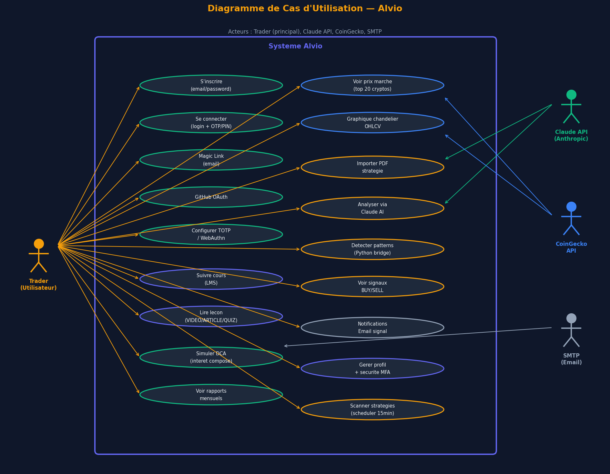
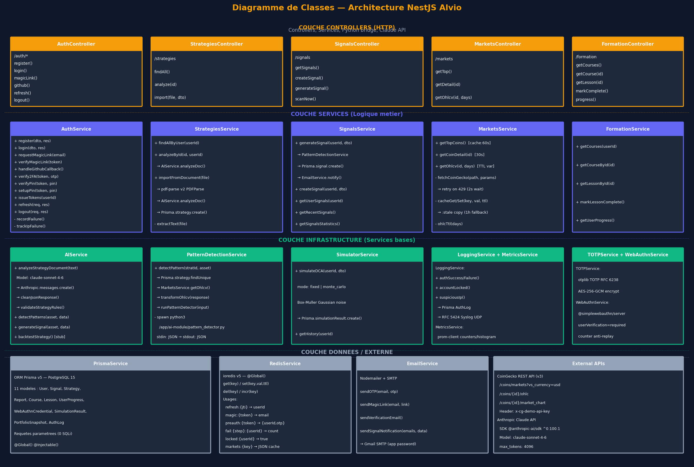
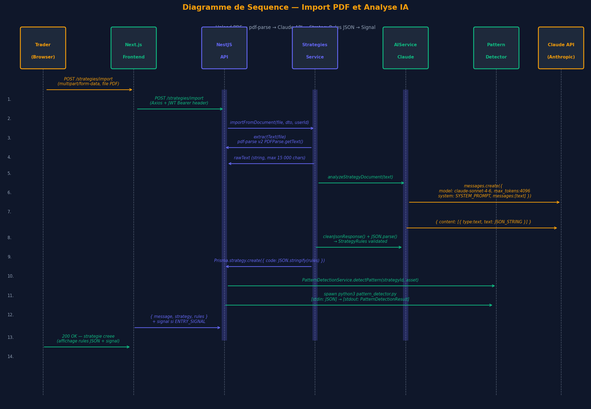
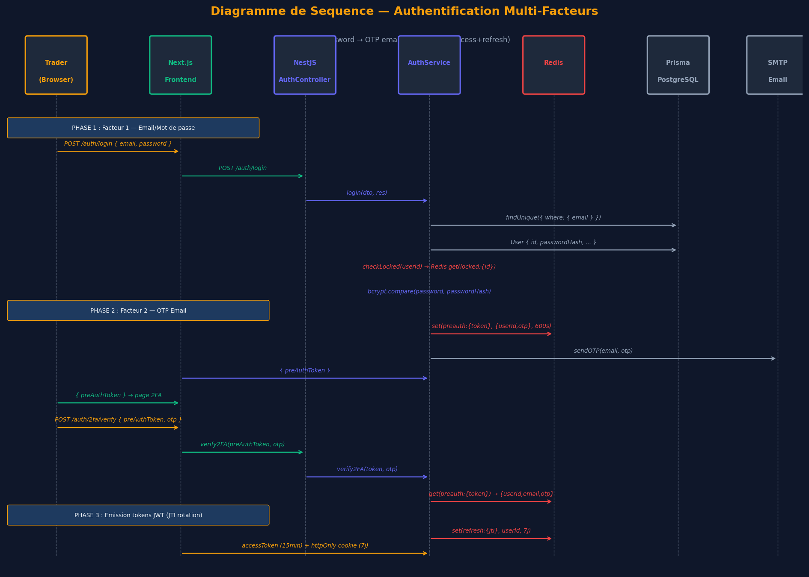

# Modélisation UML

---

## Diagramme de cas d'utilisation



### Acteurs

| Acteur | Rôle dans le système |
|---|---|
| **Trader** (acteur principal) | Utilisateur authentifié — déclenche toutes les actions métier |
| **Claude API** (Anthropic) | Acteur externe — reçoit le texte extrait du PDF, retourne les StrategyRules JSON |
| **CoinGecko API** | Acteur externe — fournit les données de marché (top 20, OHLCV) |
| **SMTP** (Gmail) | Acteur externe — achemine les OTP, magic links et notifications de signal |

### Cas d'utilisation principaux

**Authentification (6 use cases)**
- S'inscrire avec email/password → `POST /auth/register`
- Se connecter (login + OTP email ou TOTP ou PIN) → `POST /auth/login` + `POST /auth/2fa/verify`
- Se connecter via Magic Link → `POST /auth/magic-link/request` + `GET /auth/magic-link/verify`
- Se connecter via GitHub OAuth → `GET /auth/github` → callback → redirect frontend
- Configurer TOTP (QR code, confirmation) → `POST /mfa/totp/enroll` + `POST /mfa/totp/verify`
- Enregistrer une clé WebAuthn → `POST /mfa/webauthn/register-options` + `register-verify`

**Marchés (2 use cases)**
- Voir les prix du marché (top 20 cryptos, sparklines) → `GET /markets` — cache Redis 60 s
- Consulter le graphique chandelier OHLCV d'un actif → `GET /markets/:id/ohlcv`

**IA & Signaux (4 use cases)**
- Importer un PDF de stratégie → `POST /strategies/import` (Multer, 10 MB max, pdf-parse v2)
- Analyser une stratégie via Claude AI → `POST /strategies/:id/analyze` → claude-sonnet-4-6
- Déclencher la détection de patterns Python → `POST /signals/generate` → spawn stdin/stdout
- Consulter les signaux BUY → `GET /signals` (50 derniers) + `GET /signals/statistics`

**Formation (2 use cases)**
- Parcourir le catalogue de cours et lire une leçon → `GET /formation/courses`
- Marquer une leçon comme complète → `POST /formation/progress`

**Outils (3 use cases)**
- Simuler une stratégie DCA → `POST /simulator/dca`
- Consulter les rapports mensuels → `GET /reports/:year/:month`
- Gérer son profil et sa sécurité MFA → `/profile` + `/profile/security`

---

## Diagramme de classes



Le diagramme de classes représente les **4 couches de l'architecture NestJS** :

### Couche 1 — Controllers (HTTP)

Reçoivent les requêtes HTTP, valident les DTOs via `class-validator`,
extraient l'identité de l'utilisateur depuis le token JWT (`@GetUser()`),
et délèguent immédiatement au service correspondant.

```
AuthController         → /auth/*
StrategiesController   → /strategies
SignalsController      → /signals
MarketsController      → /markets
FormationController    → /formation
SimulatorController    → /simulator
ReportsController      → /reports/:year/:month
AIController           → /ai/*
TOTPController         → /mfa/totp/*
WebAuthnController     → /mfa/webauthn/*
MetricsController      → /metrics  (restreint par IP)
AppController          → /health
```

Chaque controller est décoré `@UseGuards(JwtAuthGuard)` sur les routes
protégées — seul `AuthController` expose des endpoints publics.

### Couche 2 — Services métier

Contiennent la logique applicative. Dépendances injectées via le constructeur
(`PrismaService`, `RedisService`, `AIService`, etc.).

**AuthService** (519 lignes) — orchestrateur du système MFA :
```typescript
// src/auth/auth.service.ts
async login(dto: LoginDto, res: Response, ip?: string): Promise<void> {
  // 1. Trouver l'utilisateur → Prisma
  // 2. Vérifier le verrou Redis (locked:{userId})
  // 3. bcrypt.compare(password, passwordHash)
  // 4. recordFailure() si échec → incrémente fail:login:{userId}
  // 5. Si succès : générer OTP → Redis preauth:{token} (TTL 600s)
  //    → EmailService.sendOTP() → retourner { preAuthToken }
}
```

**StrategiesService** — pipeline PDF → Claude :
```typescript
// src/strategies/strategies.service.ts
async importFromDocument(file: Express.Multer.File, dto, userId: string) {
  const rawText = await this.extractText(file);          // pdf-parse v2
  const truncated = rawText.slice(0, 15_000);            // max 15 000 chars
  const rules = await this.aiService.analyzeStrategyDocument(truncated);
  return this.prisma.strategy.create({ data: { ...dto, userId, code: JSON.stringify(rules) } });
}
```

**MarketsService** — cache anti-429 :
```typescript
// src/markets/markets.service.ts — double clé Redis
private async cacheSet<T>(key: string, value: T, ttl: number): Promise<void> {
  const s = JSON.stringify(value);
  await this.redis.set(key, s, ttl);             // clé fraîche
  await this.redis.set(`${key}:stale`, s, 3_600); // fallback si 429
}
```

### Couche 3 — Services infrastructure

Services techniques transverses, tous `@Injectable()` et `@Global()` pour les
plus partagés (`PrismaService`, `RedisService`).

**AIService** — appel Claude :
```typescript
// src/ai/ai.service.ts
const CLAUDE_MODEL = 'claude-sonnet-4-6'; // ligne 14 — hardcodé

async analyzeStrategyDocument(text: string): Promise<StrategyRules> {
  const client = new Anthropic({ apiKey: this.config.get('ANTHROPIC_API_KEY') });
  const response = await client.messages.create({
    model: CLAUDE_MODEL, max_tokens: 4096,
    system: SYSTEM_PROMPT,
    messages: [{ role: 'user', content: text }],
  });
  const raw = (response.content[0] as TextBlock).text;
  return JSON.parse(this.cleanJsonResponse(raw)); // retire ```json...```
}
```

**PatternDetectionService** — bridge Python via `spawn` :
```typescript
// src/patterns/pattern-detection.service.ts
const proc = spawn('python3', ['/app/ai-module/pattern_detector.py'], {
  stdio: ['pipe', 'pipe', 'pipe'],  // stdin / stdout / stderr
});
proc.stdin.write(JSON.stringify(input), 'utf-8');
proc.stdin.end();
// → lecture stdout → JSON.parse() → PatternDetectionResult
// → { global_status: 'ENTRY_SIGNAL' | 'EXIT_SIGNAL' | 'NO_SIGNAL', ... }
```

**TOTPService** — chiffrement AES-256-GCM :
```typescript
// src/mfa/totp/totp.service.ts
// Stockage du secret chiffré pour limiter l'exposition en cas de fuite BDD
private encrypt(text: string): string {
  const iv = crypto.randomBytes(12);
  const cipher = crypto.createCipheriv('aes-256-gcm', this.key, iv);
  // → { iv, ciphertext, authTag } sérialisé en base64
}
```

### Couche 4 — Données & Externes

- **PrismaService** : `@Global()`, wrapping `PrismaClient`, expose tous les
  modèles (`this.prisma.signal.findMany(...)`) avec requêtes paramétrées
  (protection SQLi native).
- **RedisService** : `@Global()`, wrapping `ioredis`, méthodes `get/set/del/incr`.
- **EmailService** : `nodemailer` + SMTP Gmail, fire-and-forget (non bloquant).
- **APIs externes** : CoinGecko REST v3 (via `MarketsService`) et
  Anthropic Claude (via `AIService`).

---

## Diagramme de séquence — Création de stratégie IA



Ce diagramme illustre le flux complet d'import d'un PDF de stratégie et sa
transformation en signal de trading.

**Étapes clés :**

1. **Upload** — Le Trader soumet un fichier PDF via `POST /strategies/import`
   (multipart/form-data, limite 10 MB, Multer `memoryStorage`).

2. **Extraction texte** — `StrategiesService.extractText()` appelle
   `pdf-parse v2` avec l'API classe :
   ```typescript
   // API v2 (classe, pas fonction) — breaking change vs v1
   const parser = new PDFParse({ data: file.buffer });
   const rawText = await parser.getText();
   // Tronqué à 15 000 chars avant envoi à Claude
   ```

3. **Analyse Claude** — `AIService.analyzeStrategyDocument()` envoie le texte
   à `claude-sonnet-4-6` avec un `SYSTEM_PROMPT` imposant un JSON strict.
   La réponse est nettoyée (`cleanJsonResponse`) puis validée
   (`validateStrategyRules`).

4. **Persistance** — La stratégie est créée en base :
   `Prisma.strategy.create({ code: JSON.stringify(rules) })`.

5. **Détection immédiate** — `PatternDetectionService.detectPattern()` est
   appelé immédiatement : récupération des OHLCV via `MarketsService`,
   puis `spawn python3 pattern_detector.py` (stdin/stdout).

6. **Signal** — Si `global_status === 'ENTRY_SIGNAL'`, un signal BUY est
   créé en base avec `SignalsService.createSignal()`.

---

## Diagramme de séquence — Authentification multi-facteurs



Ce diagramme couvre le flux login complet en 3 phases successives.

**Phase 1 — Facteur 1 : Email / Mot de passe**

1. `POST /auth/login { email, password }` → `AuthService.login()`
2. `Prisma.user.findUnique({ where: { email } })` → récupération du compte
3. Vérification du verrou : `Redis.get('locked:{userId}')` — si présent, `HTTP 423`
4. `bcrypt.compare(password, passwordHash)` — si KO :
   `recordFailure()` → incrémente `fail:login:{userId}` → verrou si ≥ 3 échecs
5. Si OK : génération d'un OTP 6 chiffres → `Redis.set('preauth:{token}', {userId, otp}, 600)`
   → `EmailService.sendOTP(email, otp)` → retour `{ preAuthToken }`

**Phase 2 — Facteur 2 : OTP Email**

6. `POST /auth/2fa/verify { preAuthToken, otp }` → `AuthService.verify2FA()`
7. `Redis.get('preauth:{token}')` → récupération de `{userId, email, otp_attendu}`
8. Comparaison OTP — si KO : `recordFailure()` → verrou si ≥ 3 échecs
9. Si OK : le flow continue (PIN ou émission directe des tokens selon la config)

**Phase 3 — Émission des tokens JWT (JTI rotation)**

10. `jti = crypto.randomUUID()` — identifiant unique du refresh token
11. `accessToken` : JWT signé, `expiresIn: '15m'`, transporté en mémoire côté client
12. `refreshToken` : JWT signé, `expiresIn: '7d'`, stocké :
    - **Redis** : `set('refresh:{jti}', userId, 7 * 24 * 3600)`
    - **Cookie httpOnly** : `SameSite: 'strict'`, `Secure: true`
13. À chaque `POST /auth/refresh` : le `jti` est révoqué dans Redis avant
    d'en émettre un nouveau — rotation garantissant qu'un refresh token volé
    est invalidé dès sa détection.

**Sécurité du flux**

| Menace | Contre-mesure |
|---|---|
| Brute-force login | Verrou Redis après 3 échecs — `locked:{userId}` TTL 1800 s |
| Brute-force IP | Compteur `fail:ip:{ip}` — alerté via `LoggingService` |
| Vol du refresh token | JTI rotation — token révocable individuellement |
| CSRF | Cookie `SameSite: strict` + absence du token dans les URL |
| Session fixation | Nouveau `jti` à chaque refresh — pas de réutilisation |
