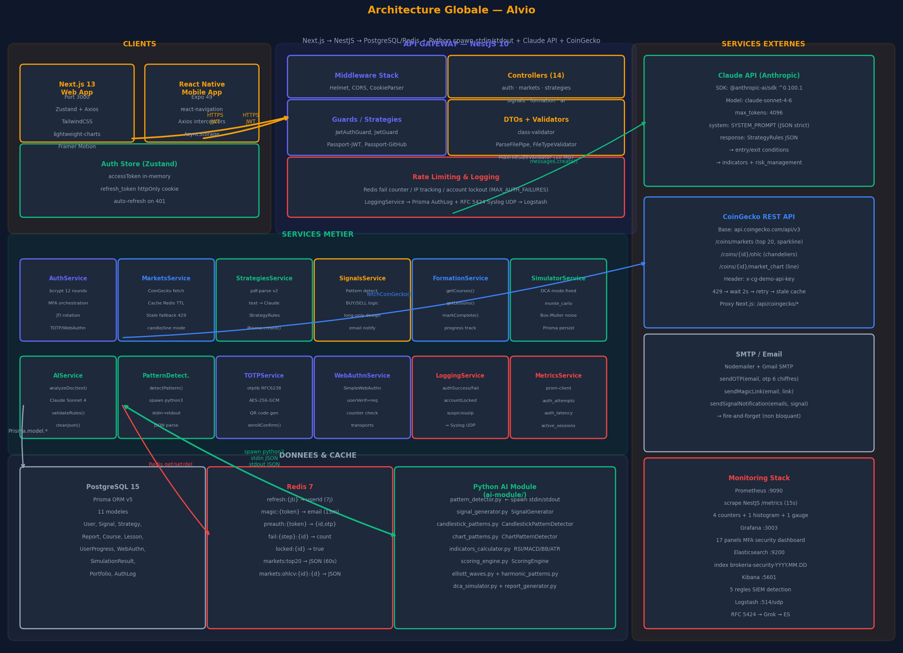

# Module IA / ML

---

## Pipeline IA global



Le module IA d'Alvio implémente une chaîne de traitement en trois étapes
successives, de l'import du document de stratégie jusqu'à la génération du
signal de trading :

```
Utilisateur
    │
    │  1. Upload fichier PDF/TXT/MD
    ▼
Multer (memoryStorage, 10 MB max)
    │
    │  2. Extraction texte brut
    ▼
pdf-parse v2 → PDFParse.getText()
    │  (tronqué à 15 000 caractères)
    │
    │  3. Analyse LLM
    ▼
Anthropic Claude API (claude-sonnet-4-6)
    │  System prompt → JSON strict
    │  Réponse : StrategyRules { entry_conditions, exit_conditions,
    │                            indicators, risk_management, confidence_score }
    ▼
Prisma.strategy.create({ code: JSON.stringify(rules) })
    │
    │  4. Détection de patterns (immédiate ou scheduler 15 min)
    ▼
PatternDetectionService
    │  → MarketsService.getOhlcv() → données CoinGecko
    │  → spawn('python3', ['pattern_detector.py'])
    │      stdin  : JSON { ohlcv[], strategy_rules, asset, timeframe }
    │      stdout : JSON PatternDetectionResult { global_status, signals,
    │                                             patterns, indicators }
    ▼
SignalsService.generateSignal()
    │  ENTRY_SIGNAL → Prisma.signal.create({ direction:'BUY', status:'OPEN' })
    │  EXIT_SIGNAL  → Prisma.signal.update({ status:'CLOSED', exit_price })
    ▼
EmailService.sendSignalNotification()   (fire-and-forget)
```

---

## Import et parsing PDF

### Réception du fichier — Multer

```typescript
// src/strategies/strategies.controller.ts
@Post('import')
@UseGuards(JwtAuthGuard)
@UseInterceptors(
  FileInterceptor('file', {
    storage: memoryStorage(),  // fichier conservé en Buffer RAM, jamais écrit sur disque
  })
)
async importFromDocument(
  @UploadedFile(
    new ParseFilePipe({
      validators: [
        new MaxFileSizeValidator({ maxSize: 10 * 1024 * 1024 }), // 10 MB
        new FileTypeValidator({ fileType: /(pdf|text|markdown)/ }),
      ],
    })
  ) file: Express.Multer.File,
  @Body() dto: ImportStrategyDto,
  @GetUser('sub') userId: string,
) {
  return this.strategiesService.importFromDocument(file, dto, userId);
}
```

### Extraction du texte — pdf-parse v2

La version 2 de `pdf-parse` rompt avec l'API v1 : la fonction directe est
remplacée par une classe `PDFParse` à instancier avec un objet `{ data: Buffer }`.

```typescript
// src/strategies/strategies.service.ts
private async extractText(file: Express.Multer.File): Promise<string> {
  // Import dynamique nécessaire — pdf-parse v2 n'a pas d'export ES module standard
  const { PDFParse } = require('pdf-parse') as {
    PDFParse: new (opts: { data: Buffer }) => { getText(): Promise<string> };
  };

  const parser = new PDFParse({ data: file.buffer });
  const text   = await parser.getText();

  // Troncature avant envoi à Claude — limite de tokens du prompt
  const MAX_TEXT_LENGTH = 15_000;
  return text.slice(0, MAX_TEXT_LENGTH);
}
```

> **Pourquoi 15 000 caractères ?** Le `SYSTEM_PROMPT` de Claude consomme déjà
> plusieurs centaines de tokens. Tronquer le texte à ~15 000 caractères garantit
> de rester dans la fenêtre de `max_tokens: 4096` définie pour la réponse,
> sans risquer un dépassement côté entrée.

---

## Strategy Engine IA — Appel Claude

### Modèle et constante

```typescript
// src/ai/ai.service.ts — ligne 14
const CLAUDE_MODEL = 'claude-sonnet-4-6'; // modèle fixé, jamais modifié à l'exécution
```

### Prompt système

Le `SYSTEM_PROMPT` impose à Claude de répondre **exclusivement** en JSON,
sans texte explicatif, sans balises Markdown, selon un schéma fixé :

```typescript
// src/ai/ai.service.ts
const SYSTEM_PROMPT = `
Tu es un expert en analyse technique et en trading algorithmique.
Ton rôle est d'analyser les documents de stratégie de trading et d'en extraire
les règles de manière structurée.

IMPORTANT : Réponds UNIQUEMENT avec un objet JSON valide, sans texte supplémentaire,
sans balises markdown. Structure exacte requise :
{
  "name": "string",
  "description": "string",
  "asset": "string",
  "timeframe": "string",
  "entry_conditions": ["condition1", "condition2"],
  "exit_conditions": ["condition1", "condition2"],
  "indicators": [{ "name": "string", "params": {} }],
  "risk_management": {
    "stop_loss_percent": number,
    "take_profit_percent": number,
    "max_position_size": number
  },
  "confidence_score": number  // 0 à 100
}
`;
```

### Appel API et traitement de la réponse

```typescript
// src/ai/ai.service.ts
async analyzeStrategyDocument(text: string): Promise<StrategyRules> {
  const client = new Anthropic({ apiKey: this.config.get('ANTHROPIC_API_KEY') });

  const response = await client.messages.create({
    model:      CLAUDE_MODEL,       // 'claude-sonnet-4-6'
    max_tokens: 4096,
    system:     SYSTEM_PROMPT,
    messages:   [{ role: 'user', content: text }],
  });

  // Extraction du texte brut de la réponse (type TextBlock)
  const raw = (response.content[0] as TextBlock).text;

  // Nettoyage : Claude peut encadrer le JSON de balises ```json ... ```
  const cleaned = this.cleanJsonResponse(raw);

  // Parse et validation de structure
  const parsed = JSON.parse(cleaned);
  if (!this.validateStrategyRules(parsed)) {
    throw new BadRequestException('Structure StrategyRules invalide retournée par Claude');
  }

  // Normalisation du confidence_score entre 0 et 100
  return {
    ...parsed,
    confidence_score: Math.min(100, Math.max(0, Number(parsed.confidence_score))),
  };
}

private cleanJsonResponse(raw: string): string {
  // Retire les blocs ```json ... ``` si Claude les ajoute malgré les instructions
  return raw
    .replace(/^```json\s*/i, '')
    .replace(/^```\s*/,      '')
    .replace(/\s*```$/,      '')
    .trim();
}

private validateStrategyRules(obj: unknown): obj is StrategyRules {
  if (typeof obj !== 'object' || obj === null) return false;
  const r = obj as Record<string, unknown>;
  return (
    typeof r.name               === 'string' &&
    Array.isArray(r.entry_conditions)        &&
    Array.isArray(r.exit_conditions)         &&
    typeof r.risk_management    === 'object' &&
    typeof r.confidence_score   === 'number'
  );
}
```

---

## Bridge Python — `spawn` stdin/stdout

### Choix de `spawn` vs `exec`

Le bridge utilise `child_process.spawn` avec `stdio: ['pipe','pipe','pipe']`
plutôt qu'`exec` pour deux raisons :

1. **Flux streaming** : `spawn` expose les flux stdin/stdout en temps réel —
   les données OHLCV (potentiellement volumineuses) sont écrites progressivement
   sans bufferiser toute la sortie en mémoire comme le ferait `exec`.
2. **Absence de limite de buffer** : `exec` a une limite de taille sur `stdout`
   (`maxBuffer` par défaut ~1 Mo) — les résultats d'analyse multi-patterns
   peuvent dépasser cette limite.

### Implémentation du bridge

```typescript
// src/patterns/pattern-detection.service.ts

// Mapping asset → identifiant CoinGecko
private assetToCoinId(asset: string): string {
  const map: Record<string, string> = {
    BTC: 'bitcoin', ETH: 'ethereum', SOL: 'solana',
    BNB: 'binancecoin', XRP: 'ripple', ADA: 'cardano',
    AVAX: 'avalanche-2', DOT: 'polkadot', MATIC: 'matic-network',
  };
  return map[asset.toUpperCase()] ?? asset.toLowerCase();
}

// Mapping timeframe → fenêtre de données en jours
private timeframeToDays(timeframe: string): number {
  const map: Record<string, number> = {
    '15m': 7,  '30m': 7,   // données intraday → 7 j
    '1h':  14,              // 1 heure → 14 j
    '4h':  30,              // 4 heures → 30 j
    '1d':  90, '1w': 90,   // quotidien/hebdo → 90 j
  };
  return map[timeframe] ?? 30;
}

async detectPattern(
  strategyId: string,
  asset: string,
  timeframe: string = '1h'
): Promise<PatternDetectionResult> {

  // 1. Récupération de la stratégie et de ses règles JSON
  const strategy = await this.prisma.strategy.findUnique({ where: { id: strategyId } });
  const rules: StrategyRules = JSON.parse(strategy.code);

  // 2. Données OHLCV depuis CoinGecko (via MarketsService, avec cache Redis)
  const coinId = this.assetToCoinId(asset);
  const days   = this.timeframeToDays(timeframe);
  const ohlcv  = await this.marketsService.getOhlcv(coinId, days);

  // 3. Construction de l'entrée JSON pour le script Python
  const input: PatternDetectionInput = {
    ohlcv:          this.transformOhlcv(ohlcv),  // [{ time, open, high, low, close, volume }]
    strategy_rules: rules,
    asset,
    timeframe,
  };

  // 4. Appel du bridge Python via spawn
  return this.runPatternDetector(input);
}

private runPatternDetector(input: PatternDetectionInput): Promise<PatternDetectionResult> {
  return new Promise((resolve, reject) => {
    // spawn avec stdio pipes — jamais exec
    const proc = spawn('python3', ['/app/ai-module/pattern_detector.py'], {
      stdio: ['pipe', 'pipe', 'pipe'],
    });

    let stdout = '';
    let stderr = '';

    proc.stdout.on('data', (chunk) => { stdout += chunk.toString(); });
    proc.stderr.on('data', (chunk) => { stderr += chunk.toString(); });

    proc.on('close', (code) => {
      if (code !== 0) {
        return reject(new Error(`pattern_detector.py exited with code ${code}: ${stderr}`));
      }
      try {
        resolve(JSON.parse(stdout) as PatternDetectionResult);
      } catch {
        reject(new Error(`JSON parse error from Python output: ${stdout}`));
      }
    });

    // Envoi des données d'entrée via stdin
    proc.stdin.write(JSON.stringify(input), 'utf-8');
    proc.stdin.end(); // fermeture du flux → le script Python peut commencer la lecture
  });
}
```

### Format des données échangées

**Entrée (NestJS → Python, via stdin) :**
```json
{
  "ohlcv": [
    { "time": 1717200000, "open": 67420.5, "high": 68100.0,
      "low": 67100.0, "close": 67850.0, "volume": 1842.3 }
  ],
  "strategy_rules": {
    "entry_conditions": ["RSI < 30", "EMA20 > EMA50"],
    "exit_conditions":  ["RSI > 70"],
    "indicators": [
      { "name": "RSI", "params": { "period": 14 } },
      { "name": "EMA", "params": { "period": 20 } }
    ],
    "risk_management": { "stop_loss_percent": 2, "take_profit_percent": 6 }
  },
  "asset": "BTC",
  "timeframe": "1h"
}
```

**Sortie (Python → NestJS, via stdout) :**
```json
{
  "global_status": "ENTRY_SIGNAL",
  "confidence_score": 87.3,
  "patterns": ["bullish_engulfing", "hammer"],
  "indicators": {
    "rsi":    { "value": 28.4, "signal": "oversold" },
    "ema_20": { "value": 67200.0 },
    "ema_50": { "value": 66800.0, "signal": "bullish_cross" },
    "macd":   { "value": 120.5, "signal": 85.2, "histogram": 35.3 }
  },
  "entry_price":  67850.0,
  "stop_loss":    66493.0,
  "take_profit":  71923.0
}
```

`global_status` prend l'une de trois valeurs : `ENTRY_SIGNAL`, `EXIT_SIGNAL`
ou `NO_SIGNAL`.

---

## Détection de patterns — module Python

### Scripts implémentés

Le module Python (`ai-module/`) contient 15 scripts organisés en classes :

| Script | Classe principale | Indicateurs/patterns |
|---|---|---|
| `indicators_calculator.py` | `TechnicalIndicators` | RSI (14), MACD (12/26/9), Stochastique (%K/%D), Bandes de Bollinger (20/2σ), ATR (14) |
| `candlestick_patterns.py` | `CandlestickPatternDetector` | Hammer, Shooting Star, Doji, Engulfing (haussier/baissier), Morning/Evening Star, Harami |
| `chart_patterns.py` | `ChartPatternDetector` | Head & Shoulders, Double Top/Bottom, Triangle (ascendant/descendant/symétrique), Wedge |
| `elliott_waves.py` | `ElliottWave` | Détection des vagues d'Elliott (1-2-3-4-5 impulsives + A-B-C correctives) |
| `harmonic_patterns.py` | `HarmonicPatterns` | Gartley, Butterfly, Bat, Crab (ratios de Fibonacci) |
| `ichimoku_indicator.py` | `IchimokuIndicator` | Tenkan-sen, Kijun-sen, Senkou A/B, Chikou Span, Kumo cloud |
| `scoring_engine.py` | `ScoringEngine` | Agrégation des signaux → `confidence_score` 0–100 |
| `signal_generator.py` | `SignalGenerator` | Dataclass `TradingSignal` — encapsule le signal final |
| `dca_simulator.py` | `DCASimulator` | Calcul d'intérêt composé (fixed + Box-Muller) |
| `nlp_rule_extractor.py` | — | Extraction NLP des règles (redondant avec Claude — non utilisé activement) |
| `pattern_detector.py` | — | **Point d'entrée du bridge** — orchestre les modules ci-dessus |

**Stack Python :**
```
pandas 2.0.3      → manipulation des séries temporelles OHLCV
numpy 1.24.3       → calculs vectoriels (FFT, Box-Muller, Fibonacci)
TA-Lib 0.4.27      → indicateurs techniques optimisés (C binding)
scikit-learn 1.3.0 → classification de patterns (SVM, RandomForest)
scipy 1.11.0       → analyse spectrale (ondes d'Elliott)
```

### Extrait — calcul RSI avec TA-Lib

```python
# ai-module/indicators_calculator.py
import talib
import numpy as np

class TechnicalIndicators:
    def calculate_rsi(self, close: np.ndarray, period: int = 14) -> np.ndarray:
        """RSI via TA-Lib (Wilder smoothing) — retourne un array de la même longueur."""
        return talib.RSI(close, timeperiod=period)

    def calculate_macd(self, close: np.ndarray):
        """MACD (12,26,9) — retourne (macd, signal, histogram)."""
        return talib.MACD(close, fastperiod=12, slowperiod=26, signalperiod=9)

    def calculate_bollinger_bands(self, close: np.ndarray, period: int = 20):
        """Bandes de Bollinger (20, 2σ) — retourne (upper, middle, lower)."""
        return talib.BBANDS(close, timeperiod=period, nbdevup=2, nbdevdn=2)

    def calculate_atr(self, high, low, close, period: int = 14) -> np.ndarray:
        """Average True Range — mesure de volatilité."""
        return talib.ATR(high, low, close, timeperiod=period)
```

### Extrait — scoring engine

```python
# ai-module/scoring_engine.py
class ScoringEngine:
    def compute_confidence(self, signals: list[dict]) -> float:
        """
        Agrège les signaux de différents détecteurs en un score 0–100.
        Chaque signal porte un poids selon la fiabilité du détecteur.
        """
        weights = {
            'candlestick': 0.25,
            'chart':       0.20,
            'indicator':   0.35,   # RSI/MACD → poids fort
            'ichimoku':    0.15,
            'harmonic':    0.05,
        }
        total_score = 0.0
        for sig in signals:
            w = weights.get(sig['type'], 0.1)
            total_score += sig['strength'] * w * 100

        return min(100.0, max(0.0, total_score))
```

---

## Génération des signaux — design long-only

### Décision de design assumée

Alvio adopte une architecture de signaux **long-only** (achat uniquement),
cohérente avec les stratégies de trading au comptant sur les cryptomonnaies.
Ce choix est délibéré : sur les marchés spot (sans levier ni vente à découvert),
un trader individuel ne peut pas "shorter" un actif nativement.

**Conséquence sur le modèle de données** :
- Un signal `BUY` est créé à l'entrée (`ENTRY_SIGNAL`) → `status: 'OPEN'`
- La sortie (`EXIT_SIGNAL`) **met à jour** le signal BUY existant :
  `status: 'CLOSED'`, `exit_price`, `closedAt` renseignés
- Il n'existe **pas de signal `SELL` distinct** en base de données

### Déduplication des entrées

```typescript
// src/signals/signals.service.ts
async generateSignal(userId: string, dto: GenerateSignalDto): Promise<Signal | null> {
  const detection = await this.patternDetection.detectPattern(
    dto.strategyId, dto.asset, dto.timeframe
  );

  if (detection.global_status === 'ENTRY_SIGNAL') {
    // Vérification : pas de BUY OPEN déjà existant sur cet asset/stratégie
    const existing = await this.prisma.signal.findFirst({
      where: {
        strategyId: dto.strategyId,
        asset:      dto.asset,
        direction:  'BUY',
        status:     'OPEN',
      },
    });

    if (existing) {
      // Déduplication — on ne crée pas deux entrées simultanées sur le même actif
      return null;
    }

    // Création du signal d'entrée
    const signal = await this.prisma.signal.create({
      data: {
        userId,
        strategyId:  dto.strategyId,
        asset:       dto.asset,
        timeframe:   dto.timeframe,
        direction:   'BUY',
        status:      'OPEN',
        entry_price: detection.entry_price,
        stop_loss:   detection.stop_loss,
        take_profit: detection.take_profit,
        // Stockage du score de confiance en pourcentage (0.00–100.00)
        confidence:  Math.round(detection.confidence_score * 10_000) / 100,
        patterns:    JSON.stringify(detection.patterns),
        indicators:  JSON.stringify(detection.indicators),
      },
    });

    // Notification email — fire-and-forget (non bloquant)
    this.email.sendSignalNotification([userId], signal).catch(() => {});
    return signal;
  }

  if (detection.global_status === 'EXIT_SIGNAL') {
    // Recherche du BUY OPEN correspondant
    const openSignal = await this.prisma.signal.findFirst({
      where: { strategyId: dto.strategyId, asset: dto.asset,
               direction: 'BUY', status: 'OPEN' },
    });

    if (!openSignal) return null; // aucune position à fermer

    // Clôture du signal — mise à jour (pas de création d'un SELL)
    return this.prisma.signal.update({
      where: { id: openSignal.id },
      data: {
        status:     'CLOSED',
        exit_price: detection.entry_price, // prix de marché au moment de l'EXIT
        closedAt:   new Date(),
      },
    });
  }

  return null; // NO_SIGNAL — aucune action
}
```

### Cycle de vie d'un signal

```
PatternDetector retourne ENTRY_SIGNAL
    │
    ▼
signal.create({ direction:'BUY', status:'OPEN', entry_price, stop_loss, take_profit })
    │
    │  [Temps qui passe — scheduler re-scanne toutes les 15 min]
    │
    ▼
PatternDetector retourne EXIT_SIGNAL
    │
    ▼
signal.update({ status:'CLOSED', exit_price, closedAt })
    │
    ▼
ReportsService : inclut ce signal dans le calcul mensuel (closedAt dans le mois)
```

### Scheduler automatique

```typescript
// src/signals/signal-scheduler.service.ts
@Cron('*/15 * * * *')  // toutes les 15 minutes
async runScan(): Promise<void> {
  // Récupère toutes les stratégies actives de tous les utilisateurs
  const strategies = await this.prisma.strategy.findMany({
    where: { status: 'active' },
  });

  for (const strategy of strategies) {
    await this.signalsService.generateSignal(strategy.userId, {
      strategyId: strategy.id,
      asset:      strategy.asset,
      timeframe:  strategy.timeframe,
    }).catch(() => {}); // erreur isolée — pas d'interruption du scan global
  }
}
```

---

## Rapports mensuels automatisés

`ReportsService` est entièrement implémenté. Il calcule les statistiques
mensuelles à la demande (`GET /reports/:year/:month`) à partir des signaux
Prisma — sans pré-agrégation ni tâche cron dédiée.

```typescript
// src/reports/reports.service.ts (extrait — voir fichier complet)
async getMonthlyStats(userId: string, year: number, month: number): Promise<MonthlyStats> {
  const monthStart = new Date(year, month - 1, 1);
  const monthEnd   = new Date(year, month, 1);

  const allSignals: Signal[] = await this.prisma.signal.findMany({ where: { userId } });

  // buy_signals  = entrées déclenchées ce mois (createdAt dans [monthStart, monthEnd[)
  const buySignals  = allSignals.filter(s => s.createdAt >= monthStart && s.createdAt < monthEnd);
  // sell_signals = sorties clôturées ce mois (closedAt dans [monthStart, monthEnd[)
  const sellSignals = allSignals.filter(s => s.closedAt != null &&
                                             s.closedAt >= monthStart && s.closedAt < monthEnd);
  // hold_signals = positions OPEN toujours ouvertes en fin de mois
  const holdSignals = allSignals.filter(s => s.status === 'OPEN' && s.createdAt < monthEnd);

  // Win rate : % clôtures avec exit_price > entry_price (sur les sorties du mois)
  const closed    = sellSignals.filter(s => s.exit_price != null);
  const winning   = closed.filter(s => (s.exit_price as number) > s.entry_price);
  const winRate   = closed.length > 0
    ? Math.round((winning.length / closed.length) * 10_000) / 100
    : 0;

  // P&L estimé : somme des (exit_price − entry_price) des clôtures du mois
  const totalPnl = closed.reduce((sum, s) =>
    sum + ((s.exit_price as number) - s.entry_price), 0);

  return { year, month, buy_signals: buySignals.length, sell_signals: sellSignals.length,
           hold_signals: holdSignals.length, win_rate: winRate,
           total_pnl_estimate: Math.round(totalPnl * 100) / 100, /* ... */ };
}
```

---

## Limites et perspectives d'évolution

### Fonctionnalités non encore implémentées

Deux fonctionnalités de l'`AIService` retournent actuellement des **données
fictives hardcodées** et ne doivent pas être présentées comme fonctionnelles :

#### `backtestStrategy()` — Backtesting

```typescript
// src/ai/ai.service.ts — lignes 262-278
async backtestStrategy(strategyId: string): Promise<BacktestResult> {
  // TODO : implémenter le vrai backtesting
  // Actuellement : retourne des données fictives pour éviter les erreurs d'API
  return {
    totalTrades:    42,
    winRate:        67.5,
    profitFactor:   1.8,
    maxDrawdown:    12.3,
    sharpeRatio:    1.4,
    totalReturn:    34.7,
    // Ces valeurs sont hardcodées — elles ne reflètent aucune donnée réelle
  };
}
```

**Piste d'évolution** : implémenter un backtesting réel en récupérant
l'historique OHLCV CoinGecko sur 1 à 3 ans, en appliquant les `StrategyRules`
signal par signal, et en calculant les métriques (drawdown, Sharpe, profit factor)
depuis les trades simulés.

#### `getPatternsHistory()` — Historique des patterns

```typescript
// src/ai/ai.service.ts — lignes 247-256
async getPatternsHistory(userId: string): Promise<PatternHistory[]> {
  // TODO : agréger l'historique depuis Prisma Signal.patterns (champ JSON)
  // Actuellement : retourne un tableau fictif
  return [
    { pattern: 'bullish_engulfing', count: 12, successRate: 75 },
    { pattern: 'rsi_oversold',      count: 8,  successRate: 62 },
    // Ces données sont hardcodées — elles ne proviennent pas de la base
  ];
}
```

**Piste d'évolution** : agréger le champ `Signal.patterns` (JSON array) de
tous les signaux CLOSED de l'utilisateur, calculer le taux de réussite
(`exit_price > entry_price`) par pattern, et retourner un vrai classement.
Les données sont déjà présentes en base — il s'agit uniquement d'écrire
la requête d'agrégation.

### Autres perspectives

| Limite actuelle | Évolution envisageable |
|---|---|
| Polling HTTP (scheduler 15 min) | WebSocket temps réel — push immédiat lors d'un ENTRY_SIGNAL |
| Pattern detector monolithique | Pipeline distribuée (Celery / Redis Queue) pour les scans parallèles multi-utilisateurs |
| `nlp_rule_extractor.py` non utilisé | Remplacement partiel de Claude par extraction NLP locale pour réduire les coûts API |
| Signaux long-only | Extension aux marchés avec levier (futures) — nécessite des signaux SELL réels |
| Modèle Claude fixé | Rendre le modèle configurable par utilisateur ou par type d'analyse |
